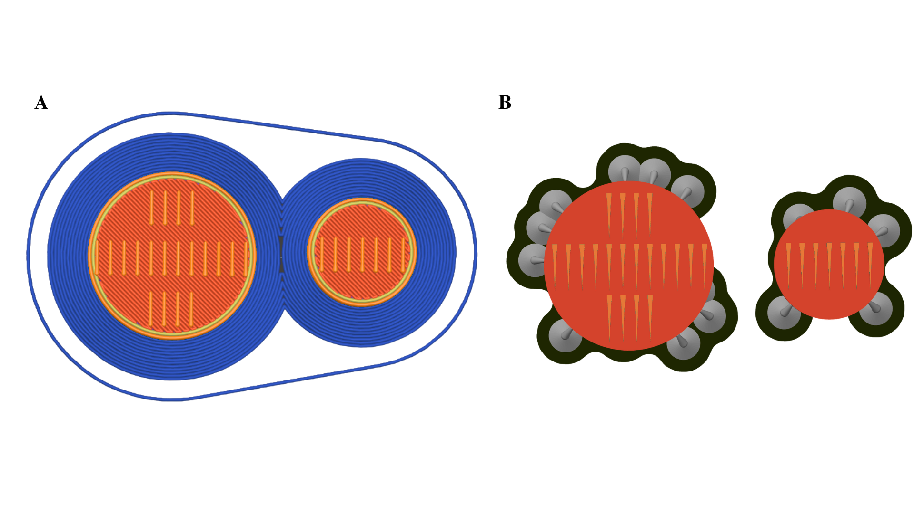

# Customizable FDM 3D-printed zebrafish embryo molds for live imaging

This repository provides design files, printing instructions, and documentation for 3D-printed zebrafish embryo orientation molds. The molds are designed to ensure dorsal positioning of embryos during live imaging  between 48 hours post-fertilization (hpf) and 5 days post-fertilization (dpf).

Unlike previously published molds fabricated with stereolithography (SLA)–based 3D printing (e.g., Geng & Peterson, 2021; Kleinhans & Lecaudey, 2019; Miller et al., 2025; Wittbrodt et al., 2014), our approach uses fused deposition modeling (FDM). Both SLA and FDM are part of the broader category of additive manufacturing, in which objects are built up layer by layer rather than removed from a solid block (subtractive manufacturing) or formed in a mold (injection molding).
- SLA printing relies on a laser or UV light to cure liquid resin layer by layer, producing parts with very fine resolution and smooth surfaces.
- FDM printing extrudes melted thermoplastic filament (such as PLA) through a heated nozzle to build up layers, making it widely accessible and cost-effective but with lower resolution.

Because of these differences, SLA prints can reproduce the sharp triangular cavities of the CAD design, while FDM prints approximate them with rectangular cavities due to nozzle width (Figure 1A vs 1B). Nevertheless, the molds (Figure 2) remain highly effective for stabilizing zebrafish embryos, while being affordable and easy to reproduce in most laboratory settings.

**Figure 1.** Differences, through gcode preview, in mold slots between FDM (A) and SLA (B) printing.

**Figure 2.** FDM-printing based mold design enhances the live in vivo imaging of the brain vascularization of zebrafish embryos. 
(A) CAD renderings of two circular mold sizes (20 mm and 13 mm) with slot dimensions in mm. Each slot measures 0.40 mm wide at the narrowest point, 0.60 mm at the widest, and extends 5.50 mm deep; the spacing between slots is 1.00 mm, and the slot height above the base is 2.00 mm. The smaller mold was designed for use with 14 mm coverslips, while the larger one was tested with 21 mm coverslips. The mold design was kept circular rather than rectangular to fit tightly within the well and stay level. Design files for both sizes are available for download via the associated GitHub repository. 
(B) Perspective views of the assembled molds. 
(C) Wells in 1% low-melting-point agarose were made using the seven- and twenty-tooth molds in 14- and 21-mm glass-bottom dishes, respectively. 
(D) PrusaSlicer g-code preview illustrating how FDM resolution (0.4 mm nozzle) converts triangular cavities into rectangular slots. 
(E) Exploded view of mold components, with a removable handle to facilitate positioning in small dishes. 
(F) Left Top. Image showing empty agarose wells created using the seven-teeth mold. Left Bottom. Image showing 56 hpf Tg(fli1a:GFP);Tg gata1a:DsRed) larvae inserted into the wells. The orange rectangle indicates an area magnified in the next panel. Right. Magnified area of mounted larvae. Live imaging of the middle larvae, marked with an orange square, is illustrated in the next panels. Scale bars: left panels 1 mm, right panel 500 µm. 
(G) Brightfield midplane-volume image of the 56hpf larvae Tg(fli1a:GFP);Tg (gata1a:DsRed) just before the onset of time-lapse acquisition. Scale bar: 50 µm.
(H) Maximum intensity projection of horizontal sections of overnight time-lapse imaging of vasculature, Tg(Fli1a:GFP, cyan), and erythrocytes, Tg(gata1a:DsRed, red), in the developing brain of the mounted larvae.  The first timepoint is shown in panel (i). Temporal color coding of the fli1:GFP signal over the acquisition (time-lapse, 20min imaging interval, 32 time points) (ii). Color-bar indicates the transition from time-point 1 (magenta) to 32 (bright yellow). See also Movie S1. Scale bars: 50 µm. 
(I) High-magnification (63x) imaging of brain vascularization process. Shown is the maximum intensity projection of the first acquisition time point (i). Magnified area (indicated with an orange rectangle) shows filopodia-like protrusions extending from the fli1:GFP-positive (cyan) endothelial tip cell (ii). Scale bars: 25 µm and 5 µm, respectively. 

**Supplementary Movie S1.** Part A. Vascular development in the developing braing. Part B. Zoom-in into the brain vascularizarion process. Same embryo as in Part A.

---

## 📂 Repository contents

- `design_files/`
  - `stl/` → ready-to-print STL files  
  - `f3d/` → Fusion 360 editable files  
  - `step/` → STEP files for CAD interoperability  
- `printing/`
  - `gcode/` → tested gcode files for 3D printers  
  - `slicer_profiles/` → PrusaSlicer config (.3mf / .ini)  
  - `printing_settings.md` → detailed printing settings  
- `docs/`
  - `zebrafish-molds-application-note.pdf`  
  - `figures/`   
- `LICENSE`  

---

## 🖨 Printing instructions

1. Download STL files from `design_files/stl/`.
2. Open in PrusaSlicer (or your slicer of choice).  
   - Recommended settings are included in `printing/printing_settings.md`.
3. Print using PLA material with a 0.4 mm nozzle...  
4. Sand the printed molds to remove rough edges.  
5. Apply a thin coat of two-part epoxy to create a smooth, sealed surface. Allow to cure fully before use.

---

## 🔍 Design considerations

- **Circular footprint**: Chosen to fit tightly into 14 mm and 21 mm coverslip dishes. 
- **FDM vs SLA**: FDM printing with a 0.4 mm nozzle limits precision, resulting in rectangular cavities instead of sharp triangular ones. Functionality is unaffected, but geometric fidelity is reduced.  
- **Stage compatibility**: Optimized for zebrafish between 48 hpf–5 dpf.  
- **Accessibility**: All files are openly shared for reproduction and adaptation.

⚠️ **Note:** Embryos younger than 48 hpf are too small for this design. Separate molds with smaller wells would be required.

## 📚 References

- Geng, Y., & Peterson, R. T. (2021). Rapid Mounting of Zebrafish Larvae for Brain Imaging. Zebrafish, 18(6), 376. https://doi.org/10.1089/zeb.2021.0062 
- Kleinhans, D. S., & Lecaudey, V. (2019). Standardized mounting method of (zebrafish) embryos using a 3D-printed stamp for high-content, semi-automated confocal imaging. BMC Biotechnology, 19(1), 68. https://doi.org/10.1186/s12896-019-0558-y 
- Miller, J. C., Koirala, P., Torre, M. F. A. de la, Farsi, M., Lieberth, J., Shrestha, R., & Bloomekatz, J. (2025). Custom 3D-Printed Molds for Zebrafish Imaging and Cardiac Development. Journal of Visualized Experiments (JoVE), 222, e68768. https://doi.org/10.3791/68768 
- Wittbrodt, J. N., Liebel, U., & Gehrig, J. (2014). Generation of orientation tools for automated zebrafish screening assays using desktop 3D printing. BMC Biotechnology, 14(1), 36. https://doi.org/10.1186/1472-6750-14-36 

---

## 📖 Citation

